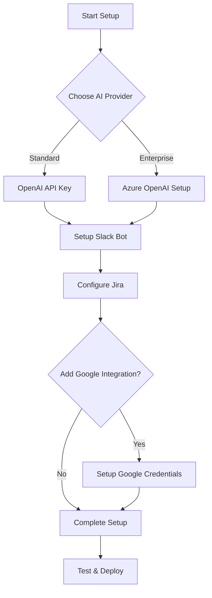

# PM Bot Setup Instructions 📚

Welcome to the PM Bot setup instructions! This directory contains comprehensive guides for generating all the credentials needed to run the Project Management Bot.

## Quick Start 🚀

To get your PM Bot up and running, you'll need to configure credentials for several services. Follow the guides in this order:

### 1. **Essential Services** (Required)
These services are required for basic PM Bot functionality:

| Service | Guide | Purpose | Required |
|---------|-------|---------|----------|
| **🤖 Slack** | [slack-credentials.md](slack-credentials.md) | Bot interface and commands | ✅ Yes |
| **🎯 Jira** | [jira-credentials.md](jira-credentials.md) | Epic and story creation | ✅ Yes |
| **🤖 OpenAI** | Use standard OpenAI API | AI for content generation | ✅ Yes (or Azure) |

### 2. **Enhanced Services** (Optional)
These services provide additional features:

| Service | Guide | Purpose | Required |
|---------|-------|---------|----------|
| **🤖 Azure OpenAI** | [azure-openai-credentials.md](azure-openai-credentials.md) | Enterprise AI services | ⚠️ Alternative to OpenAI |
| **📅 Google** | [google-credentials.md](google-credentials.md) | Meeting notes processing | 🔧 Optional |

## Setup Overview 🗺️



## Step-by-Step Setup ⚡

### Phase 1: Core Setup (30-45 minutes)

1. **🤖 AI Service** (Choose one):
   - **Option A**: Get OpenAI API key from https://platform.openai.com/
   - **Option B**: Follow [Azure OpenAI Setup](azure-openai-credentials.md) for enterprise

2. **💬 Slack Bot** (15 minutes):
   - Follow [Slack Credentials Guide](slack-credentials.md)
   - Create bot, get tokens, configure permissions

3. **🎯 Jira Integration** (15 minutes):
   - Follow [Jira Credentials Guide](jira-credentials.md)
   - Generate API token, configure permissions

### Phase 2: Environment Configuration (10 minutes)

4. **📝 Configure Environment**:
   ```bash
   # Copy environment template
   cp environment.template.txt .env
   
   # Edit with your credentials
   nano .env
   ```

5. **🧪 Test Configuration**:
   ```bash
   # Install test dependencies (using uv - recommended)
   uv pip install requests slack-bolt openai google-api-python-client
   
   # Or using pip
   pip install requests slack-bolt openai google-api-python-client
   
   # Test each service
   python test_google_auth.py    # If using Google
   python test_jira_auth.py     # Test Jira
   python test_slack_auth.py    # Test Slack
   ```

### Phase 3: Optional Enhancements (20 minutes)

6. **📅 Google Integration** (Optional):
   - Follow [Google Credentials Guide](google-credentials.md)
   - Enables meeting notes processing

7. **🚀 Deploy and Test**:
   ```bash
   docker-compose up -d
   ```

## Credential Summary 📋

After completing setup, you'll have these credentials in your `.env` file:

### Required Credentials:
```env
# Slack Bot
SLACK_BOT_TOKEN=xoxb-...
SLACK_SIGNING_SECRET=...
SLACK_APP_TOKEN=xapp-...

# AI Service (choose one)
OPENAI_API_KEY=sk-...                    # Standard OpenAI
# OR
USE_AZURE_OPENAI=true                    # Azure OpenAI
AZURE_OPENAI_ENDPOINT=https://...
AZURE_OPENAI_API_KEY=...

# Jira
JIRA_SERVER=https://your-domain.atlassian.net
JIRA_USERNAME=your-email@company.com
JIRA_API_TOKEN=ATATT3...
JIRA_PROJECT_KEY=PROJ
```

### Optional Credentials:
```env
# Google Integration (optional)
GOOGLE_CREDENTIALS_FILE=credentials.json
GOOGLE_TOKEN_FILE=token.json
```

## Troubleshooting Quick Reference 🔧

### Common Issues:

| Problem | Solution | Guide |
|---------|----------|-------|
| Slack bot not responding | Check tokens and scopes | [Slack Guide](slack-credentials.md) |
| Jira creation fails | Verify permissions and project key | [Jira Guide](jira-credentials.md) |
| AI requests fail | Check API key and quotas | [Azure OpenAI Guide](azure-openai-credentials.md) |
| Google auth errors | Verify scopes and API enablement | [Google Guide](google-credentials.md) |

### Test Commands:
```bash
# Quick connection tests
curl -H "Authorization: Bearer $SLACK_BOT_TOKEN" https://slack.com/api/auth.test
curl -u $JIRA_USERNAME:$JIRA_API_TOKEN "$JIRA_SERVER/rest/api/3/myself"
python test_google_auth.py
```

## Security Best Practices 🔒

### Credential Management:
- ✅ Store credentials in `.env` file (never commit to git)
- ✅ Use environment variables in production
- ✅ Rotate tokens regularly (every 90 days)
- ✅ Use minimal required permissions
- ✅ Monitor access logs and usage

### Network Security:
- ✅ Use HTTPS for all API calls
- ✅ Implement rate limiting
- ✅ Set up IP restrictions where possible
- ✅ Use VPN for server-to-server communication

## Service-Specific Quick Links 🔗

### Slack
- **Create App**: https://api.slack.com/apps
- **Documentation**: https://api.slack.com/
- **Socket Mode Guide**: https://api.slack.com/apis/connections/socket

### Jira
- **API Tokens**: https://id.atlassian.com/manage-profile/security/api-tokens
- **Documentation**: https://developer.atlassian.com/cloud/jira/platform/rest/v3/
- **MCP Atlassian**: https://github.com/sooperset/mcp-atlassian

### OpenAI / Azure OpenAI
- **OpenAI API Keys**: https://platform.openai.com/api-keys
- **Azure Portal**: https://portal.azure.com/
- **Azure OpenAI Studio**: https://oai.azure.com/

### Google
- **Cloud Console**: https://console.cloud.google.com/
- **API Library**: https://console.cloud.google.com/apis/library
- **Credentials**: https://console.cloud.google.com/apis/credentials

## Support and Resources 📞

### Getting Help:
1. **Check the specific service guide** for detailed troubleshooting
2. **Review logs** using `./docker-run.sh logs`
3. **Test individual components** using provided test scripts
4. **Search documentation** for the specific service
5. **Check service status pages** for outages

### Useful Commands:
```bash
# Check bot status
./docker-run.sh status

# View logs
./docker-run.sh logs

# Restart services
docker-compose restart

# Test configuration
./docker-run.sh test
```

## What's Next? 🎯

After completing the credential setup:

1. **📖 Read the main README.md** for usage instructions
2. **🧪 Test each feature** (epic creation, meeting processing)
3. **👥 Train your team** on bot capabilities
4. **📊 Monitor usage** and optimize based on needs
5. **🔄 Set up regular maintenance** (token rotation, backups)

## Estimated Setup Time ⏱️

| Phase | Time | Services |
|-------|------|----------|
| **Core Setup** | 30-45 min | Slack + Jira + AI |
| **Google Integration** | 20 min | Calendar + Drive APIs |
| **Testing & Deployment** | 15 min | Verification + Launch |
| **Total** | 60-80 min | Complete setup |

---

**Need help?** Each service guide includes detailed troubleshooting sections and test scripts to verify your setup. Start with the essential services (Slack, Jira, OpenAI) and add optional features later.

**Ready to begin?** Choose your AI provider and start with the [Slack Credentials Guide](slack-credentials.md)! 🚀 